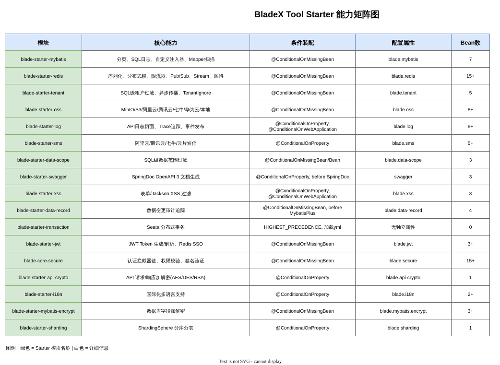
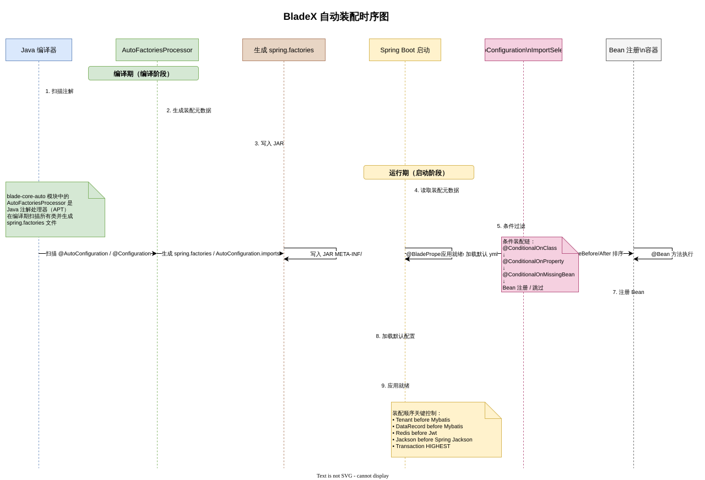
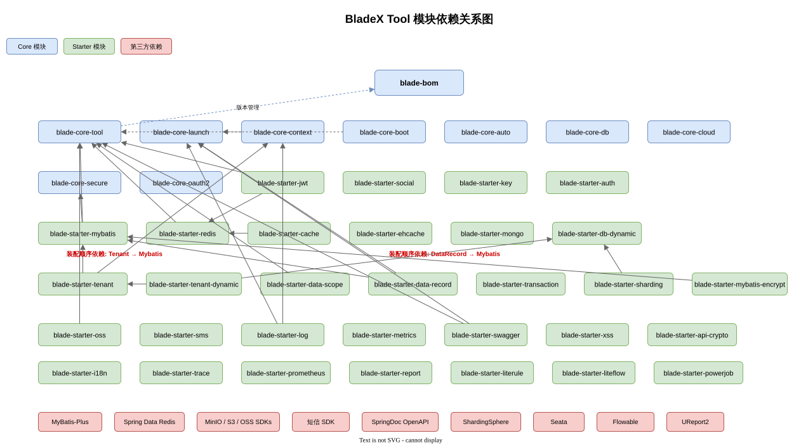
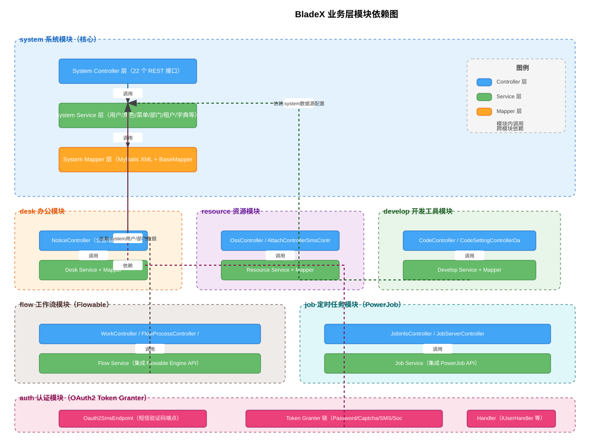
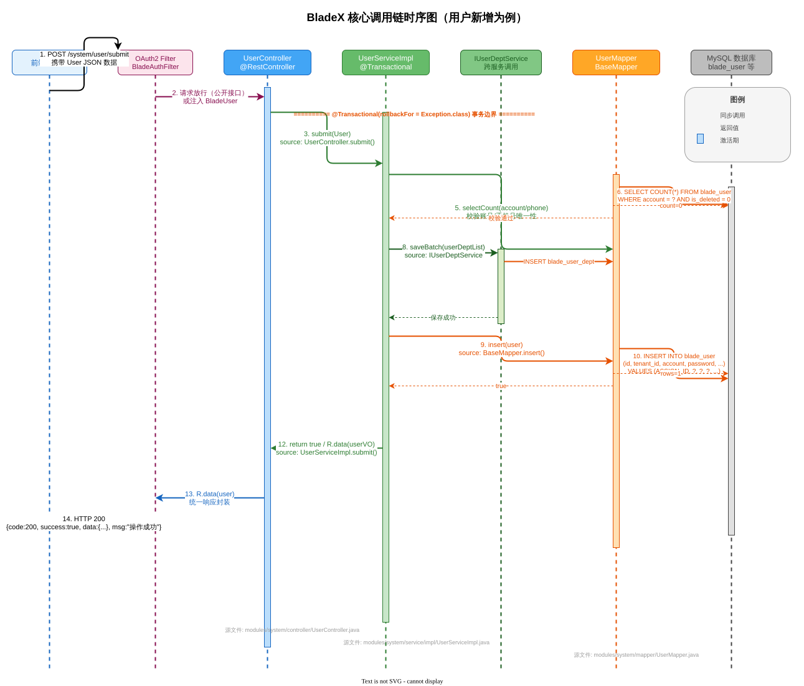
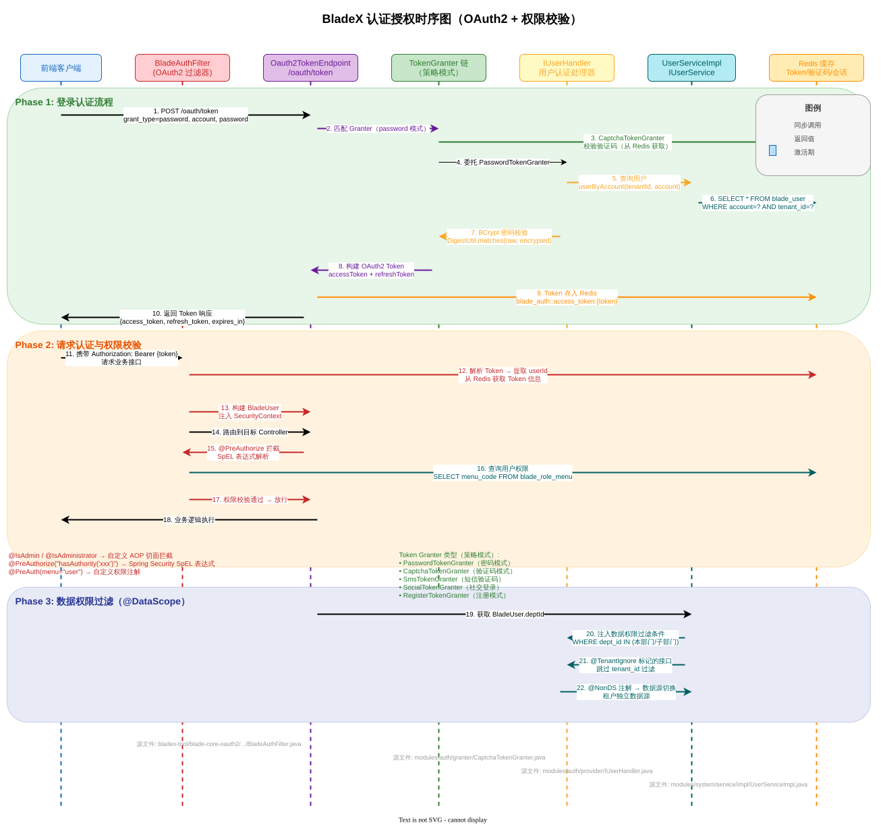
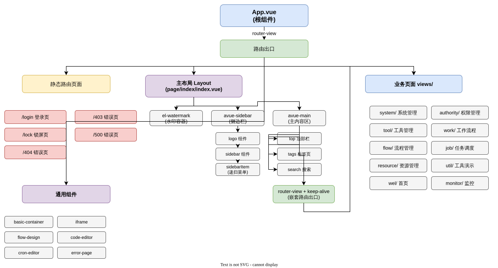
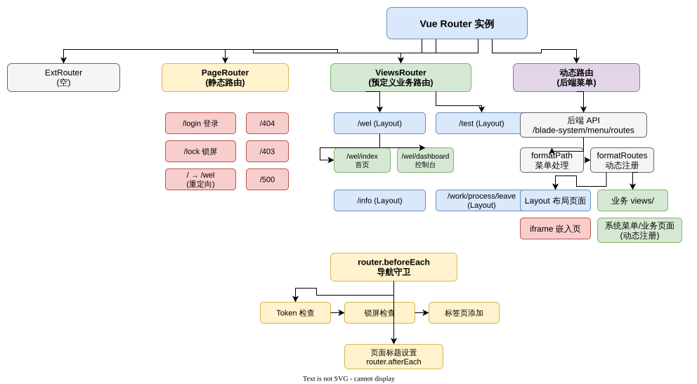
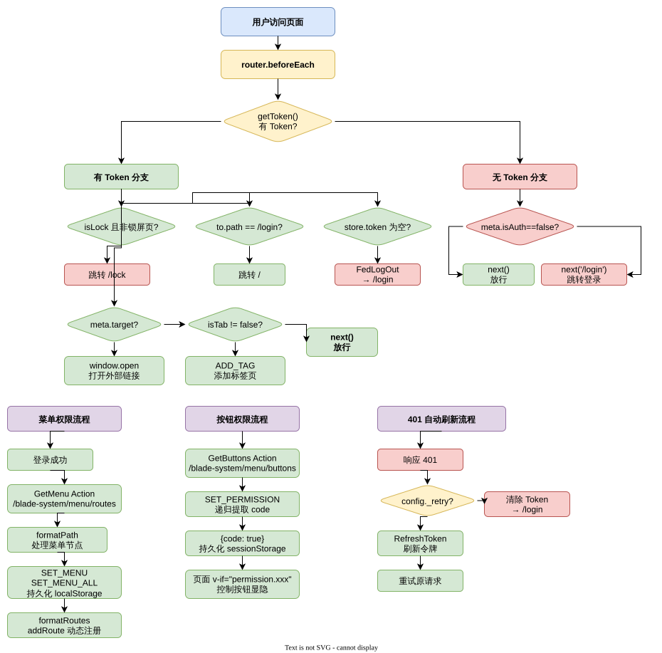
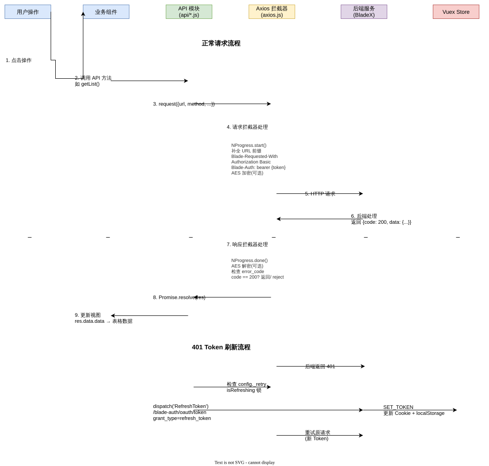

# BladeX Saber3 系统架构分析

> 分析范围：BladeX 4.8.0.RELEASE + Saber3 前端
> 数据来源：底层架构分析报告、后端分析报告、前端分析报告、接口契约分析报告

---

## 第1章：系统技术栈概述

### 1.1 整体技术栈

| 层级 | 技术 | 说明 |
|------|------|------|
| 底层框架 | BladeX Tool（自研 Starter 体系） | 823 个 Java 源文件，38 个可独立引入模块 |
| 后端业务 | Spring Boot 3.5.9 + MyBatis-Plus 3.5.14 | 373 个 Java 源文件，39 个 Controller |
| 前端 | Vue 3 + Vuex + Vue Router + Element Plus + Avue + Vite | 112 个 .vue 文件、84 个 .ts/.js 文件 |
| 认证 | 自定义 OAuth2（blade-core-oauth2） | 5 种 Token Granter（密码/验证码/短信/社交/注册） |
| 数据库 | MySQL + MyBatis-Plus | 42 个 Mapper 接口 + 42 个 XML 映射 |
| 缓存 | Redis | 序列化、分布式锁、限流器、Pub/Sub、Stream |
| 工作流 | Flowable | 流程定义、部署、执行 |
| 任务调度 | PowerJob | 分布式任务调度 |
| 构建 | Maven（后端）+ Vite（前端） | BOM 统一依赖管理 |

### 1.2 核心架构特征

- **编译期自动装配生成**：`blade-core-auto` 模块通过注解处理器在编译期自动生成 `spring.factories` 和 `AutoConfiguration.imports`，开发者无需手动维护自动装配元数据
- **Starter 模块化体系**：38 个可独立引入模块，通过 `blade-bom` 统一管理版本
- **多租户三层隔离**：SQL 层（TenantLineInnerInterceptor）、数据源层（动态数据源路由）、对象存储层（按租户隔离文件路径）
- **Avue 配置驱动 CRUD**：前端通过 Avue 框架实现配置化的列表/表单/表格操作
- **SM2 + AES 双层加密**：前端敏感数据 SM2 加密传输，请求/响应可选 AES-CBC 加密

---

## 第2章：整体架构描述

### 2.1 架构分层

```
┌─────────────────────────────────────────────────────────┐
│                    前端层（Saber3）                       │
│  Vue 3 + Vuex + Vue Router + Element Plus + Avue        │
│  入口：src/main.js → App.vue → permission.js（路由守卫）  │
├─────────────────────────────────────────────────────────┤
│                  HTTP 通信层（Axios 封装）                  │
│  请求拦截：Token注入 / 租户头 / SM2+AES加密 / Basic认证    │
│  响应拦截：401自动刷新 / 错误处理 / OAuth2错误码优先显示     │
├─────────────────────────────────────────────────────────┤
│              认证层（blade-core-oauth2）                   │
│  OAuth2 Filter → Token 解析 → BladeUser 注入              │
│  Token Granter：password/captcha/sms/social/register     │
├─────────────────────────────────────────────────────────┤
│              安全层（blade-core-secure）                   │
│  拦截器链：Basic → Sign → Token → Client                 │
│  权限切面：@PreAuth / @IsAdmin / @IsAdministrator         │
├─────────────────────────────────────────────────────────┤
│              业务层（bladex-boot）                         │
│  39 个 Controller → 91 个 Service → 42 个 Mapper          │
│  模块：system / desk / resource / develop / flow / job    │
├─────────────────────────────────────────────────────────┤
│              数据层                                        │
│  MyBatis-Plus 拦截器链：租户过滤 → 数据审计 → 分页          │
│  Redis 缓存 / 分布式锁 / 限流                              │
│  动态数据源（租户级隔离）                                    │
└─────────────────────────────────────────────────────────┘
```

### 2.2 三层关系

- **底层架构层**（blade-core-* / blade-starter-*）提供基础设施能力，通过 Starter 机制被后端业务层引入
- **后端业务层**（bladex-boot）基于底层架构的能力构建业务模块（系统管理、工作台、资源、开发工具、工作流、定时任务）
- **前端层**（Saber3）通过 Axios 封装与后端 HTTP 接口交互，实现动态路由注册和按钮权限控制

---

## 第3章：架构全景图

### 3.1 底层架构图







### 3.2 后端架构图



> **注意**：`backend-module-dependency.drawio` 的 SVG 导出失败，该图需在 GUI 环境下手动导出。详见 `后端-分析报告.md` 附录 A。





### 3.3 前端架构图









---

## 第4章：模块划分与职责

### 4.1 底层架构模块

详见 `底层架构-分析报告.md` 第2章。

#### Core 核心模块（12 个）

| 模块 | 职责 |
|------|------|
| `blade-core-tool` | 工具类库（40+ Util）、Jackson 定制、消息解析、敏感词过滤 |
| `blade-core-boot` | Web MVC 配置、请求包装、重试、AOP 启用 |
| `blade-core-launch` | 应用启动器、属性加载、环境检测 |
| `blade-core-context` | 请求上下文（租户ID、用户ID、TraceID 传递） |
| `blade-core-secure` | 安全认证（拦截器链、权限校验、签名验证） |
| `blade-core-oauth2` | OAuth2 认证服务（Token 授予、端点） |
| `blade-core-cloud` | Cloud 支持（Feign、Sentinel、版本路由） |
| `blade-core-db` | 数据库基础配置 |
| `blade-core-auto` | 编译期注解处理器（自动装配元数据生成） |

#### 关键 Starter 模块

| 模块 | 职责 |
|------|------|
| `blade-starter-mybatis` | MyBatis-Plus 增强（分页、SQL 日志、租户过滤） |
| `blade-starter-redis` | Redis 增强（序列化、分布式锁、限流、Pub/Sub） |
| `blade-starter-tenant` | 多租户（SQL 级隔离、异步传播、忽略） |
| `blade-starter-tenant-dynamic` | 动态数据源（租户级数据源切换） |
| `blade-starter-oss` | 对象存储（MinIO/S3/阿里云/腾讯云/七牛/华为云/本地） |
| `blade-starter-sms` | 短信服务（阿里云/腾讯云/七牛/云片） |
| `blade-starter-jwt` | JWT Token 生成/解析、Redis 单点登录 |
| `blade-starter-log` | 日志切面（API 日志、错误日志、Trace） |
| `blade-starter-data-scope` | 数据权限（SQL 级数据范围过滤） |
| `blade-starter-swagger` | API 文档（SpringDoc OpenAPI 3） |
| `blade-starter-flowable` | 工作流（Flowable 引擎定制） |
| `blade-starter-powerjob` | PowerJob 分布式任务调度 |

### 4.2 后端业务模块

详见 `后端-分析报告.md` 第1章。

| 模块 | 路径前缀 | Controller 数 | 职责 |
|------|---------|-------------|------|
| 系统管理 | /blade-system | 18 | 用户、角色、菜单、部门、租户、字典、岗位等核心管理 |
| 工作台 | /blade-desk | 1 | 公告、请假流程示例 |
| 资源管理 | /blade-resource | 4 | OSS 配置、附件、短信配置 |
| 开发工具 | /blade-develop | 5 | 代码生成、数据源、数据模型 |
| 工作流 | /blade-flow | 6 | 流程定义、部署、待办/已办 |
| 定时任务 | /blade-job | 2 | 任务信息、任务服务管理 |
| 日志 | /blade-log | 3 | 常规日志、错误日志、API 日志 |
| 认证 | /blade-auth | - | OAuth2 Token、验证码、登出 |

### 4.3 前端模块

详见 `前端-分析报告.md` 第2章。

| 模块 | 路径 | 职责 |
|------|------|------|
| 应用入口 | `src/main.js` | Vue 应用创建、插件注册 |
| 根组件 | `src/App.vue` | 路由出口 |
| 路由 | `src/router/` | 静态路由 + 动态路由注册 |
| 权限守卫 | `src/permission.js` | 导航守卫、Token 校验 |
| 状态管理 | `src/store/modules/` | user / common / tags / logs / dict 五模块 |
| HTTP 客户端 | `src/axios.js` | Axios 封装、拦截器 |
| API 层 | `src/api/` | 34 个 API 文件，按业务模块组织 |
| 视图层 | `src/views/` | 业务页面 |
| 通用组件 | `src/components/` | 基础容器、流程设计器、代码编辑器等 |
| Mixins | `src/mixins/` | CRUD 通用逻辑、Token 定时刷新 |

---

## 第5章：核心类/组件关系

### 5.1 后端核心类关系

#### 实体继承体系

```
Serializable（基础实体）
  └── TenantEntity（含 tenantId, isDeleted）
        ├── User
        ├── Tenant
        └── 其他租户实体
  ├── Role
  ├── Menu
  ├── Dept
  └── 其他简单实体
```

#### Wrapper 转换模式

```
Entity → XxxWrapper.build().entityVO(entity) → VO
Entity List → XxxWrapper.build().listVO(list) → VO List
Entity List → XxxWrapper.build().listNodeVO(list) → VO 树形列表
IPage<Entity> → XxxWrapper.build().pageVO(pages) → IPage<VO>
```

#### 统一响应体

```
R<T> = { code: int, success: boolean, data: T, msg: String }
```

详见 `后端-分析报告.md` 第1.2节。

### 5.2 前端核心组件关系

#### 组件树顶层

```
App.vue → router-view
  ├── PageRouter（登录、锁屏、错误页）
  ├── ViewsRouter（主布局 Layout）
  │   ├── avue-sidebar（Logo + 递归菜单）
  │   └── avue-main（顶部栏 + 标签页 + 内容区 + keep-alive）
  └── 动态路由（后端菜单 → formatRoutes → addRoute）
```

详见 `前端-分析报告.md` 第2章。

### 5.3 安全拦截器链

```
请求进入
  → LogTraceFilter（注入 TraceID）
  → BasicInterceptor（HTTP Basic Auth）
  → SignInterceptor（签名校验 + Nonce 防重放）
  → TokenInterceptor（Token 校验）
  → ClientInterceptor（客户端认证）
  → @PreAuth / @IsAdmin / @IsAdministrator（方法级权限）
  → Controller
```

详见 `底层架构-分析报告.md` 第5章 AR-012。

---

## 第6章：架构评价

### 6.1 架构优势

| 优势 | 说明 |
|------|------|
| Starter 模块化 | 38 个可独立引入模块，按需装配，BOM 统一版本管理 |
| 编译期自动装配 | `blade-core-auto` 降低 starter 开发门槛 |
| 多层租户隔离 | SQL 层、数据源层、OSS 层三重隔离 |
| OAuth2 标准化 | 5 种 Granter 覆盖常见登录场景 |
| Avue 配置驱动 | 前端 CRUD 配置化，减少样板代码 |
| 双层加密 | SM2 + AES 保障传输安全 |

### 6.2 架构风险

| 风险 | 说明 |
|------|------|
| Vuex 非 Pinia | 前端使用 Vuex 而非 Vue 3 推荐的 Pinia，后续迁移成本 |
| 无 i18n 后端实现 | 后端错误消息均为硬编码中文，无国际化基础设施 |
| 部分 Controller 无权限保护 | `WorkController`、`SearchController`、`LeaveController` 无权限注解 |
| HTTP 状态码宽松 | 前端 `validateStatus` 接受 200-500 为有效响应，可能掩盖服务端错误 |
| 冷启动路由隐患 | 动态路由在应用启动时立即执行，但 menuAll 可能为空 |

---

**报告生成日期**: 2026-05-21
