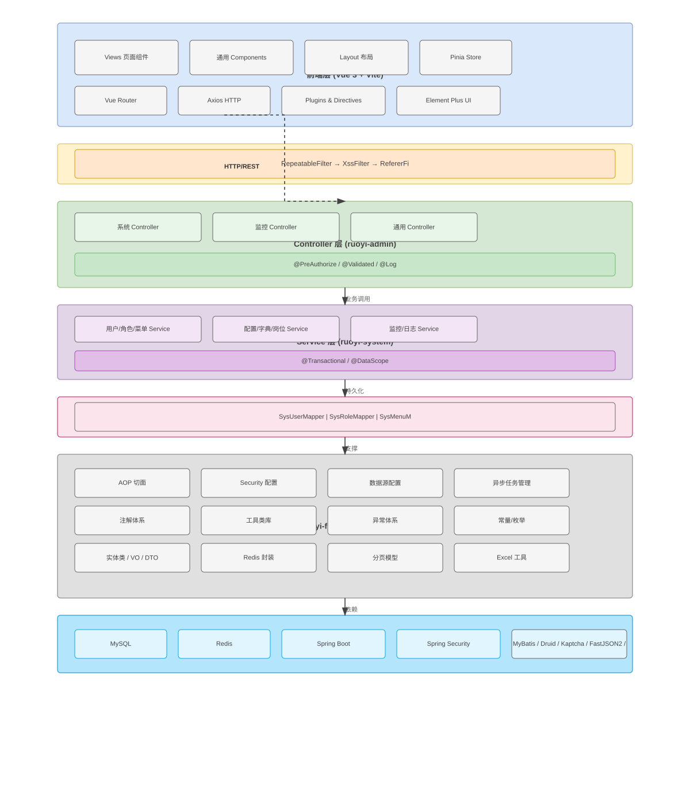
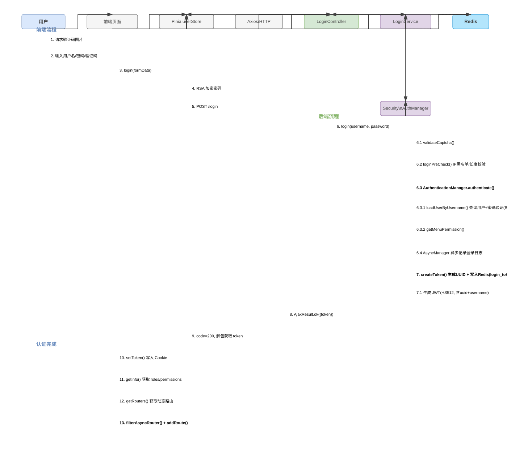
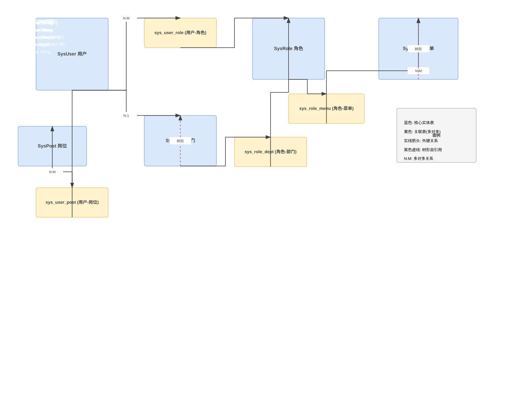
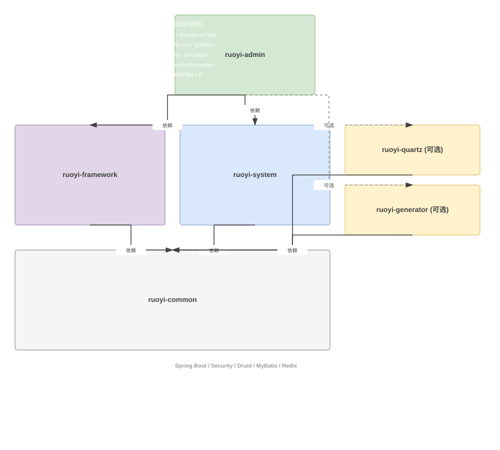
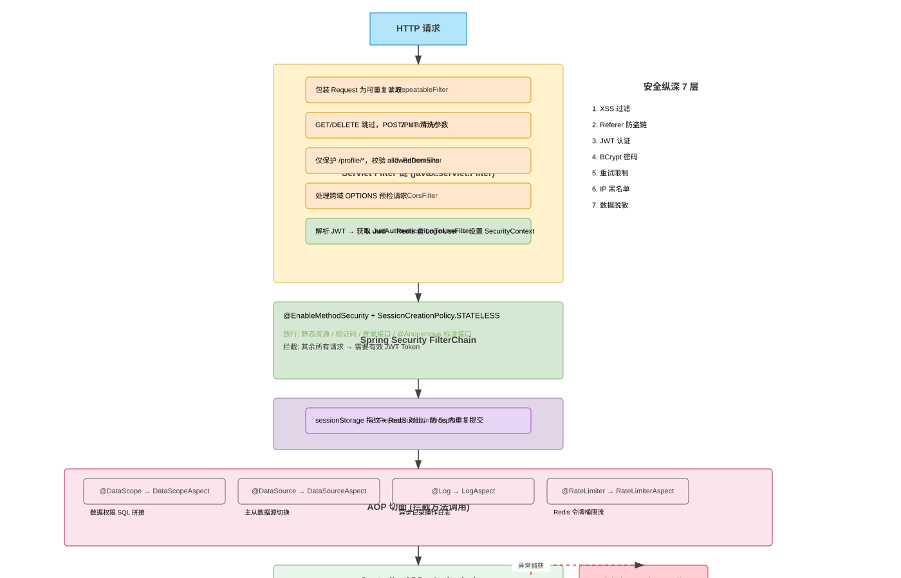
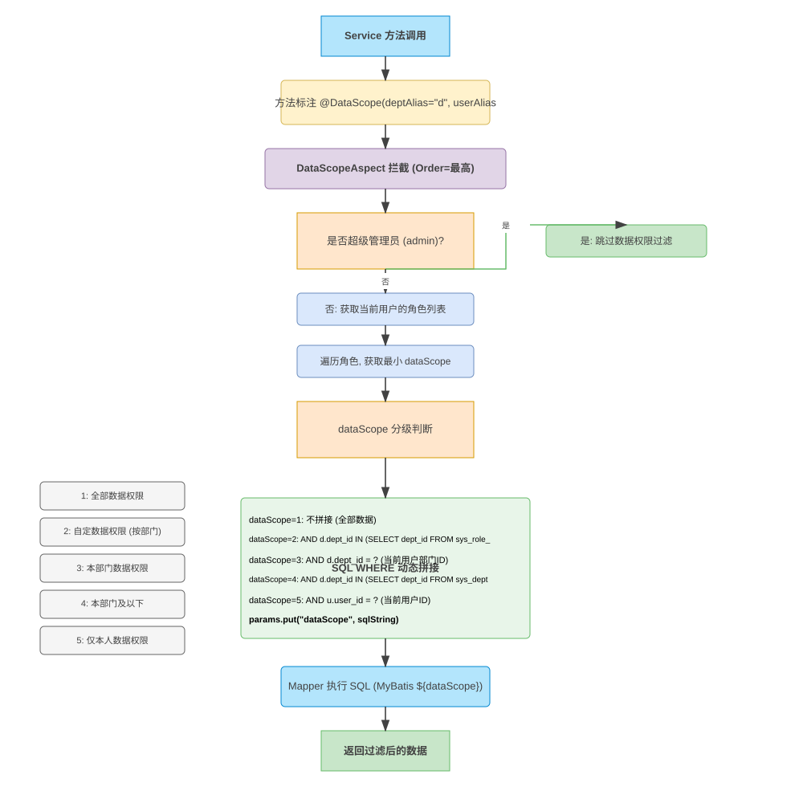
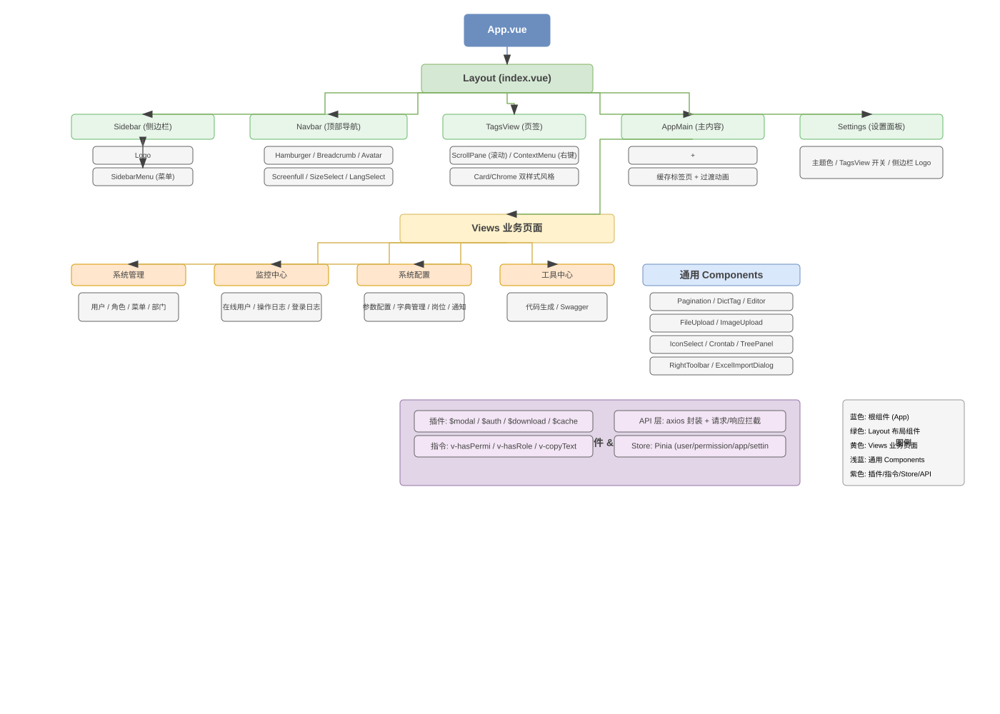

# 01 系统架构分析

> 本文档综合 RuoYi-Vue3 底层架构、后端业务、前端、接口契约四份分析报告，输出系统架构全景视图。

---

## 1. 技术栈全景表

### 1.1 后端技术栈

| 分类 | 技术 | 版本/说明 |
|------|------|----------|
| 核心框架 | Spring Boot | 3.x |
| 安全框架 | Spring Security | 7（@EnableMethodSecurity） |
| ORM | MyBatis | XML 映射 + 动态 SQL |
| 数据库连接池 | Druid | 支持主从动态切换 |
| 缓存 | Redis | Token、配置、字典、验证码等 |
| Token | JWT（JJWT） | HS512 签名，仅做签名验证 |
| 验证码 | Kaptcha | 支持 math/char 两种模式 |
| Excel | Apache POI | @Excel 注解驱动导入导出 |
| API 文档 | Swagger/OpenAPI 3 | SpringDoc |
| 数据库 | MySQL | 默认 |

### 1.2 前端技术栈

| 分类 | 技术 | 版本 |
|------|------|------|
| 框架 | Vue 3 | 3.5.26 |
| 构建工具 | Vite | 6.4.1 |
| UI 库 | Element Plus | 2.13.1 |
| 状态管理 | Pinia | 3.0.4 |
| 路由 | Vue Router | 4.6.4 |
| HTTP 客户端 | Axios | 1.13.2 |
| CSS 预处理 | Sass (dart-sass) | embedded 1.97.2 |
| 图表 | ECharts | 5.6.0 |
| 富文本 | @vueup/vue-quill | 1.2.0 |
| 加密 | jsencrypt | 3.3.2（RSA） |
| 工具库 | @vueuse/core | 14.1.0 |
| 模糊搜索 | fuse.js | 7.1.0 |

### 1.3 基础设施

| 分类 | 技术 | 说明 |
|------|------|------|
| 构建工具 | Maven | 多模块管理 |
| JDK | Java 17+ | 适配 Spring Boot 3 |
| 序列化 | FastJSON2 | Redis 序列化，带白名单防护 |

---

## 2. 架构分层

### 2.1 后端分层

```
┌─────────────────────────────────────────┐
│  Controller 层 (ruoyi-admin)            │
│  HTTP 入口，权限注解(@PreAuthorize)       │
│  参数校验(@Validated)，响应包装(AjaxResult)│
├─────────────────────────────────────────┤
│  Service 层 (ruoyi-system)              │
│  业务逻辑，事务控制(@Transactional)       │
│  数据权限注解(@DataScope)                │
├─────────────────────────────────────────┤
│  Mapper 层 (ruoyi-system)               │
│  MyBatis XML 映射，动态 SQL              │
├─────────────────────────────────────────┤
│  框架层 (ruoyi-framework)               │
│  Security、Token、AOP 切面、Filter       │
│  异步任务、数据源、拦截器                 │
├─────────────────────────────────────────┤
│  公共层 (ruoyi-common)                  │
│  实体类、工具类、注解、枚举、异常         │
│  常量、Redis 封装、分页模型              │
└─────────────────────────────────────────┘
```

### 2.2 前端分层

```
┌─────────────────────────────────────────┐
│  Views 层 (src/views/)                  │
│  业务页面组件，CRUD 标准模板              │
│  权限指令(v-hasPermi)，表单校验           │
├─────────────────────────────────────────┤
│  Components 层 (src/components/)        │
│  通用组件（Pagination/DictTag/Editor等）   │
├─────────────────────────────────────────┤
│  Layout 层 (src/layout/)                │
│  侧边栏、顶部栏、页签、主内容区            │
├─────────────────────────────────────────┤
│  Store 层 (src/store/modules/)          │
│  Pinia 状态管理（user/permission/app等）  │
├─────────────────────────────────────────┤
│  API 层 (src/api/)                      │
│  Axios 封装，统一请求/响应拦截            │
├─────────────────────────────────────────┤
│  Plugins & Directives                   │
│  全局插件($modal/$auth/$download等)       │
│  自定义指令(v-hasPermi/v-hasRole)        │
└─────────────────────────────────────────┘
```

### 2.3 安全分层

```
请求 → RepeatableFilter（可重复读）
     → XssFilter（XSS 过滤）
     → RefererFilter（防盗链）
     → CorsFilter（跨域）
     → Spring Security FilterChain
          → JwtAuthenticationTokenFilter（JWT 认证）
     → Spring Interceptor（防重复提交）
     → AOP Aspect（数据权限/限流/日志/数据源）
     → Controller（@PreAuthorize 权限校验）
```

---

## 3. 模块依赖关系

### 3.1 Maven 模块依赖

```
ruoyi-admin (Controller 层)
  ├── ruoyi-framework (框架层)
  │     ├── ruoyi-common (公共层)
  │     └── Spring Security / Druid / MyBatis / Redis
  ├── ruoyi-system (业务层)
  │     ├── ruoyi-common
  │     └── MyBatis
  └── ruoyi-quartz (定时任务，可选)
  └── ruoyi-generator (代码生成，可选)
```

### 3.2 前端模块依赖

```
main.js (入口)
  ├── router (路由 + 权限守卫 permission.js)
  ├── store (Pinia: user/permission/app/settings/tagsView/dict/lock)
  ├── plugins (modal/auth/tab/cache/download)
  ├── directives (hasPermi/hasRole/copyText)
  ├── components (全局注册: DictTag/Pagination/FileUpload 等)
  └── App.vue → Layout → Views
```

### 3.3 核心业务依赖

| 模块 | 依赖的 Service | 说明 |
|------|---------------|------|
| 用户管理 | ISysUserService, ISysRoleService, ISysDeptService, ISysPostService | 用户-角色-部门-岗位关联 |
| 角色管理 | ISysRoleService, TokenService | 角色权限变更需刷新在线用户 |
| 菜单管理 | ISysMenuService | 菜单树构建，路由名称检查 |
| 部门管理 | ISysDeptService | 树形结构，ancestors 维护 |
| 参数配置 | ISysConfigService, RedisCache | 启动时全量加载到 Redis |
| 字典管理 | ISysDictTypeService, ISysDictDataService, DictUtils | 按 dictType 分组缓存 |

---

## 4. 核心调用链

### 4.1 登录调用链

```
前端: login.vue
  → userStore.login({username, password, code, uuid})
    → POST /login (API: login.js)
      → 请求拦截器注入 Token(首次无)
      → 响应拦截器: code=200 解包 → setToken(Cookie)

后端: SysLoginController.login()
  → SysLoginService.login()
    → 1. validateCaptcha() -- Redis 获取验证码
    → 2. loginPreCheck() -- IP 黑名单、长度校验
    → 3. AuthenticationManager.authenticate()
         → UserDetailsServiceImpl.loadUserByUsername()
              → 查询用户 → 检查状态 → 密码验证(含重试限制)
              → SysPermissionService.getMenuPermission()
    → 4. AsyncManager 异步记录登录日志
    → 5. 更新登录 IP/时间
    → 6. TokenService.createToken()
         → 生成 UUID → 写入 Redis(login_tokens:{uuid})
         → 生成 JWT(HS512, 含 uuid + username)

前端: permission.js 守卫
  → 检测 Token → getInfo() → 获取 roles/permissions
  → permissionStore.generateRoutes() → GET /getRouters
  → filterAsyncRouter() → addRoute() → 重定向
```

### 4.2 用户列表查询调用链

```
前端: system/user/index.vue
  → onMounted: getDeptTree() + getList()
  → listUser(queryParams) → GET /system/user/list
    → 请求拦截器: 注入 Authorization: Bearer {JWT}

后端: SysUserController.list() [@PreAuthorize("@ss.hasPermi('system:user:list')")]
  → ISysUserService.selectUserList() [@DataScope(deptAlias="d", userAlias="u")]
    → DataScopeAspect @Before:
         → 遍历用户角色 → 根据 dataScope 拼接 SQL WHERE
         → 注入到 BaseEntity.params.dataScope
    → SysUserMapper.selectUserList() → MyBatis XML
         → WHERE 中 ${params.dataScope} 被替换
    → 返回 PageHelper 分页结果
  → 包装为 TableDataInfo → AjaxResult

前端: Axios 响应拦截器 → code=200 → 解包 res.data
  → 赋值 userList, total
```

### 4.3 前端路由加载流程

```
用户首次访问(有 Token)
  → router.beforeEach 守卫
  → roles 为空 → getInfo() → userStore 填充 roles/permissions
  → permissionStore.generateRoutes()
       → GET /getRouters → 后端返回 RouterVo 树
       → filterAsyncRouter(): 'Layout' → Layout 组件
                             'ParentView' → ParentView
                             其他 → loadView() 动态 import
       → filterDynamicRoutes(): 按 permissions/roles 过滤前端动态路由
       → router.addRoute() 注册
  → return { ...to, replace: true } → 重新导航
```

---

## 5. 安全架构

### 5.1 认证机制

| 机制 | 实现 | 状态 |
|------|------|------|
| 认证方式 | Spring Security + JWT + Redis 双层验证 | ✅ |
| Session 策略 | STATELESS（无状态） | ✅ |
| CSRF | 禁用（Token 架构不需要） | ✅ |
| Token 存储 | JWT（签名）+ Redis（数据） | ✅ |
| Token 续期 | 剩余不足 20 分钟自动刷新 | ✅ |
| 密码加密 | BCryptPasswordEncoder | ✅ |
| 密码重试限制 | Redis 计数，超限锁定 | ✅ |
| IP 黑名单 | `sys.login.blackIPList` 配置 | ✅ |
| 验证码 | Kaptcha，Redis 存储，可配置开关 | ✅ |

### 5.2 授权机制

| 层级 | 机制 | 说明 |
|------|------|------|
| 路由级 | 后端返回路由树 + 前端 addRoute | 无权限路由不注册 |
| 接口级 | @PreAuthorize("@ss.hasPermi('xxx')") | SpEL 表达式调用 PermissionService |
| 按钮级 | v-hasPermi / v-hasRole 指令 | 无权限从 DOM 移除 |
| 编程式 | $auth.hasPermi() / $auth.hasRole() | JS 逻辑中使用 |
| 数据级 | @DataScope AOP 切面 | 按角色 dataScope 拼接 SQL |

### 5.3 前端安全

| 机制 | 实现 | 说明 |
|------|------|------|
| XSS 防护 | 后端 XssFilter + EscapeUtil.clean() | GET/DELETE 不过滤 |
| 防重复提交 | 前端 Axios 拦截器(sessionStorage 指纹) + 后端 RepeatSubmitInterceptor | 双层防护 |
| Token 管理 | Cookie 存储(Access-Token)，请求拦截器自动注入 | ✅ |
| 401 自动退出 | 响应拦截器检测到 401 → 弹窗确认 → logOut() → 跳转 | ✅ |
| 密码加密传输 | jsencrypt RSA 加密（记住密码场景） | ✅ |

### 5.4 基础设施安全

| 机制 | 实现 | 说明 |
|------|------|------|
| Referer 防盗链 | RefererFilter 检查 allowedDomains | 仅保护 /profile/* |
| 数据脱敏 | @Sensitive + SensitiveJsonSerializer | 管理员可见原值 |
| 请求体可重复读 | RepeatableFilter + RepeatedlyRequestWrapper | 支持 @RequestBody + 手动读取 |
| 异常处理 | GlobalExceptionHandler @RestControllerAdvice | 统一返回 AjaxResult |
| Redis 反序列化防护 | FastJSON2 AUTO_TYPE 白名单(com.ruoyi) | ✅ |
| 操作日志 | @Log + LogAspect 异步写入 | 密码字段自动过滤 |

---

## 6. 架构图

### 6.1 技术架构全景图



展示前后端分层、安全网关、Controller → Service → Mapper → 基础设施 → 外部依赖的完整架构。

### 6.2 登录认证时序图



从前端登录到 JWT 生成、Redis 写入、动态路由加载的完整 13 步流程。

### 6.3 ER 关系图



用户-角色-菜单-部门-岗位实体关系，包含 5 张关联表和 2 个树形自引用（菜单、部门）。

### 6.4 模块依赖图



Maven 多模块依赖关系：ruoyi-admin → ruoyi-framework/ruoyi-system → ruoyi-common，含可选模块 quartz/generator。

### 6.5 安全过滤器链图



RepeatableFilter → XssFilter → RefererFilter → CorsFilter → JwtAuthenticationTokenFilter → Spring Security → Interceptor → AOP 七层安全纵深。

### 6.6 数据权限流程图



@DataScope 从注解 → AOP 拦截 → 超级管理员判断 → 5 级权限 → SQL 动态拼接的完整流程。

### 6.7 前端组件层级图



App.vue → Layout(Sidebar/Navbar/TagsView/AppMain/Settings) → Views → Components → Plugins/Directives/Store/API。

---

## 7. 关键设计决策

| 决策 | 选择 | 原因 |
|------|------|------|
| Token 架构 | JWT + Redis 双层 | JWT 防篡改，Redis 可实时失效，适合水平扩展 |
| 无状态 Session | STATELESS | 不依赖服务端 Session，便于分布式部署 |
| 数据权限实现 | AOP 切面 + SQL 动态拼接 | 对业务代码侵入最小，通过注解声明式使用 |
| 缓存策略 | Read-through Cache | 启动时全量加载，修改时同步更新 |
| 日志写入 | 异步（AsyncManager） | 不阻塞业务请求，延迟 10ms 执行 |
| 前端路由 | 后端动态返回 + 前端 addRoute | 按权限控制路由注册，灵活安全 |
