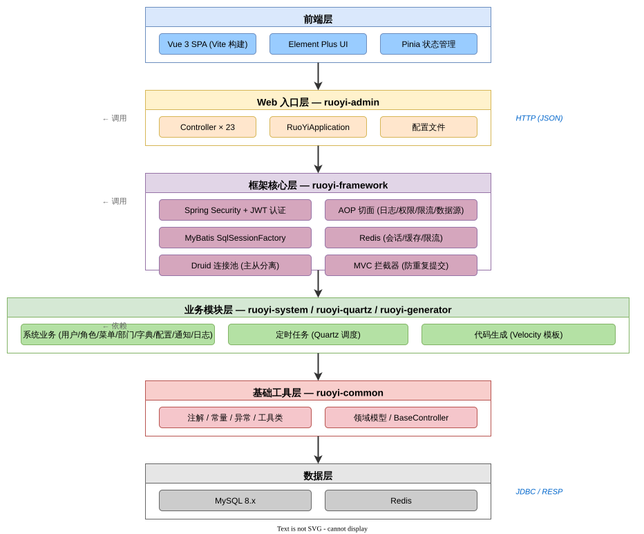
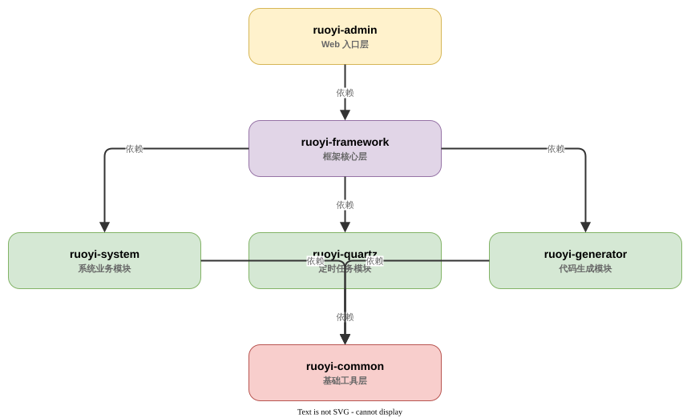
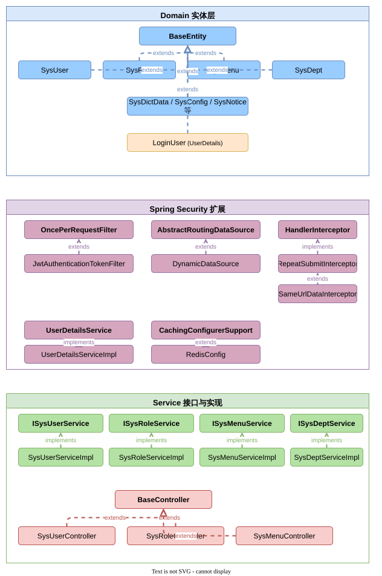
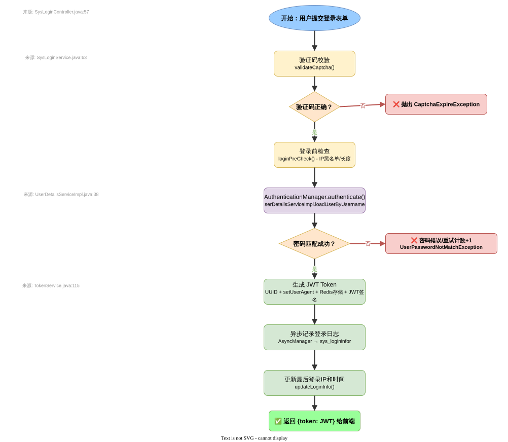
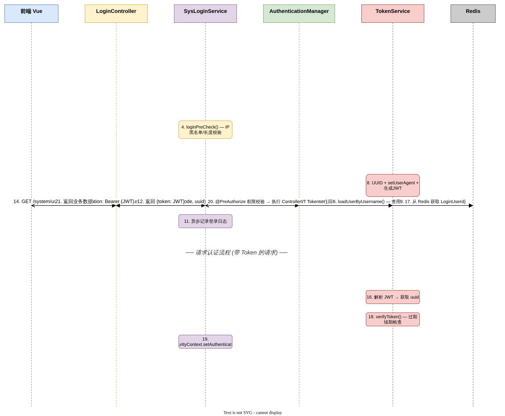
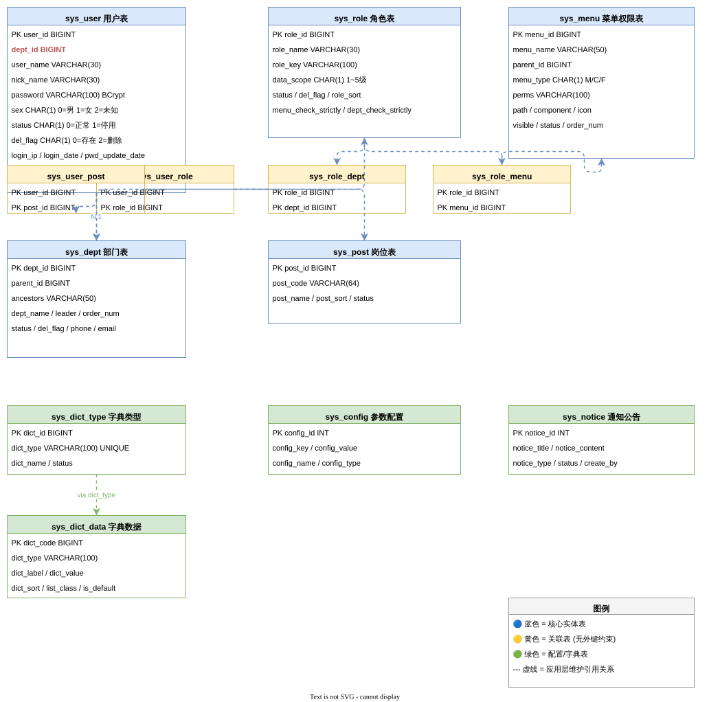

# 01 系统架构分析文档

> **分析日期：** 2026-05-20
> **源文件路径：** `sources/ruoyi/ruoyi-vue3/`
> **核心结论：** RuoYi Vue3 是一套标准的前后端分离单体管理系统，后端基于 Spring Boot 4.0.3 + Spring Security + JWT + MyBatis + Redis，前端基于 Vue 3.5 + Element Plus + Vite + Pinia。采用 RBAC 权限模型 + 5 级数据范围过滤，支持主从数据源切换、操作审计、定时任务、代码生成等企业级特性。

---

## 1. 技术架构全景

### 1.1 整体架构

```
┌─────────────────────────────────────────────────────────┐
│                    用户浏览器                            │
└──────────────────────┬──────────────────────────────────┘
                       │ HTTP
┌──────────────────────▼──────────────────────────────────┐
│                   Nginx (生产部署)                       │
│  ┌────────────────────┐    ┌──────────────────────────┐ │
│  │  静态资源 (Vue SPA) │    │  反向代理 /dev-api → :8080│ │
│  └────────────────────┘    └────────────┬─────────────┘ │
└─────────────────────────────────────────┼───────────────┘
                                          │
┌─────────────────────────────────────────▼───────────────┐
│              Spring Boot 4.0.3 (:8080)                   │
│  ┌──────────────────────────────────────────────────┐   │
│  │  ruoyi-admin (Web 入口层)                         │   │
│  │  Controller × 23  →  Service 层调用               │   │
│  └───────────────┬──────────────────────────────────┘   │
│                  │                                       │
│  ┌───────────────▼──────────────────────────────────┐   │
│  │  ruoyi-framework (框架核心层)                      │   │
│  │  ├─ Spring Security + JWT 认证过滤器链            │   │
│  │  ├─ AOP 切面 (日志/数据权限/限流/数据源)           │   │
│  │  ├─ MVC 拦截器 (防重复提交)                        │   │
│  │  ├─ MyBatis SqlSessionFactory                     │   │
│  │  ├─ Redis (用户会话/缓存/限流)                     │   │
│  │  └─ Druid 连接池 (主从分离)                        │   │
│  └───────────────┬──────────────────────────────────┘   │
│                  │                                       │
│  ┌───────────────┼──────────────────┐                   │
│  │  ruoyi-system│ruoyi-quartz      │ruoyi-generator   │
│  │  系统业务模块 │ 定时任务模块      │ 代码生成模块       │
│  │  Service/Mapper│Quartz 调度      │Velocity 模板      │
│  └───────────────┴──────────────────┴──────────────────┘   │
└──────────────────────────┬──────────────────────────────┘
                           │ JDBC
┌──────────────────────────▼──────────────────────────────┐
│                  MySQL 8.x                               │
│  20 张业务表 + 11 张 Quartz 调度表                        │
└──────────────────────────────────────────────────────────┘
```

### 1.2 技术栈清单

| 层级 | 技术 | 版本 | 说明 |
|------|------|------|------|
| **后端运行时** | Java | 17 | 最低要求 |
| **后端框架** | Spring Boot | 4.0.3 | 核心容器 |
| **安全认证** | Spring Security + JWT (jjwt 0.9.1) | - | 无状态 Token 认证 |
| **会话存储** | Redis | - | 登录会话、缓存、限流 |
| **持久层** | MyBatis + MyBatis Spring Boot | 4.0.1 | ORM 框架 |
| **连接池** | Druid | 1.2.28 | 支持主从分离、监控 |
| **分页** | PageHelper | 2.1.1 | 基于 ThreadLocal |
| **JSON** | FastJSON2 | 2.0.61 | Redis 序列化 |
| **API 文档** | SpringDoc OpenAPI | 3.0.2 | Swagger UI |
| **验证码** | Kaptcha | 2.3.3 | 图形验证码 |
| **模板引擎** | Velocity | 2.3 | 代码生成 |
| **Excel** | POI | 4.1.2 | 导入导出 |
| **前端框架** | Vue | 3.5.26 | 组合式 API |
| **前端路由** | Vue Router | 4.6.4 | History 模式 |
| **状态管理** | Pinia | 3.0.4 | 7 个 Store 模块 |
| **UI 组件库** | Element Plus | 2.13.1 | 中文 locale |
| **构建工具** | Vite | 6.4.1 | 热更新 |
| **HTTP 客户端** | Axios | 1.13.2 | 拦截器封装 |
| **图表** | ECharts | 5.6.0 | 数据可视化 |

### 1.3 模块依赖关系

```
ruoyi (parent, pom)
  │
  ├── ruoyi-common ───────────────── 基础工具层 (无内部依赖)
  │     ├── 自定义注解 (@Log/@DataScope/@RateLimiter/@RepeatSubmit 等)
  │     ├── 工具类 (SecurityUtils/MessageUtils/ExcelUtils 等)
  │     ├── 常量/异常/枚举
  │     ├── 基础领域对象 (BaseEntity/SysUser/SysRole/SysMenu/SysDept)
  │     └── 核心控制器基类 (BaseController)
  │
  ├── ruoyi-system ───► ruoyi-common ── 系统业务模块
  │     ├── Service 接口与实现 (用户/角色/菜单/部门/岗位/字典/配置/通知/日志)
  │     ├── Mapper 接口 + XML (16 个 Mapper)
  │     └── Domain 实体类
  │
  ├── ruoyi-framework ──► ruoyi-system ── 框架核心层
  │     ├── 安全配置 (SecurityConfig/JWT 过滤器/认证处理器)
  │     ├── 数据源配置 (DruidConfig/DynamicDataSource)
  │     ├── AOP 切面 (LogAspect/DataScopeAspect/DataSourceAspect/RateLimiterAspect)
  │     ├── MVC 拦截器 (RepeatSubmitInterceptor)
  │     ├── 配置类 (MyBatis/Redis/Captcha/Filter/Resources/ThreadPool/I18n)
  │     ├── Web 服务 (TokenService/SysLoginService/SysPasswordService 等)
  │     └── 全局异常处理 (GlobalExceptionHandler)
  │
  ├── ruoyi-quartz ───► ruoyi-common ──── 定时任务模块
  │     ├── Quartz 配置与调度
  │     ├── SysJob/SysJobLog 业务逻辑
  │     └── 示例任务 (RyTask)
  │
  ├── ruoyi-generator ──► ruoyi-common ── 代码生成模块
  │     ├── 数据库表元数据读取
  │     ├── Velocity 模板渲染
  │     └── 前端代码一键生成
  │
  └── ruoyi-admin ───► ruoyi-framework ── Web 入口层
        ├── ruoyi-quartz (传递依赖)
        ├── ruoyi-generator (传递依赖)
        ├── 23 个 Controller
        ├── 启动类 (RuoYiApplication)
        └── 配置文件 (application.yml / application-druid.yml)
```

### 1.4 架构图表





---

## 2. 核心类关系



### 2.1 领域实体继承链

所有领域实体继承自 `BaseEntity`（`ruoyi-common/.../core/domain/BaseEntity.java`），提供公共字段：searchValue、createBy、createTime、updateBy、updateTime、remark、params<Map>。

### 2.2 Spring Security 扩展体系

| Spring 接口/抽象类 | RuoYi 实现类 | 文件路径 |
|--------------------|-------------|----------|
| UserDetailsService | UserDetailsServiceImpl | `ruoyi-framework/.../web/service/UserDetailsServiceImpl.java` |
| AuthenticationEntryPoint | AuthenticationEntryPointImpl | `ruoyi-framework/.../security/handle/AuthenticationEntryPointImpl.java` |
| LogoutSuccessHandler | LogoutSuccessHandlerImpl | `ruoyi-framework/.../security/handle/LogoutSuccessHandlerImpl.java` |
| OncePerRequestFilter | JwtAuthenticationTokenFilter | `ruoyi-framework/.../security/filter/JwtAuthenticationTokenFilter.java` |
| HandlerInterceptor | RepeatSubmitInterceptor → SameUrlDataInterceptor | `ruoyi-framework/.../interceptor/` |
| AbstractRoutingDataSource | DynamicDataSource | `ruoyi-framework/.../datasource/DynamicDataSource.java` |
| CachingConfigurerSupport | RedisConfig | `ruoyi-framework/.../config/RedisConfig.java` |

### 2.3 Controller 继承

- `SysUserController` / `SysRoleController` / `SysMenuController` / `SysDeptController` → 继承 `BaseController`
- `SysLoginController` **不继承** BaseController

---

## 3. 核心业务流程

### 3.1 登录流程



### 3.2 安全认证时序



### 3.3 数据库 ER 关系



---

## 4. 安全认证完整链路

### 4.1 登录流程（POST /login）

| 步骤 | 方法 | 文件 | 说明 |
|------|------|------|------|
| 1 | `SysLoginController.login()` | `ruoyi-admin/.../SysLoginController.java:57` | 接收登录参数 |
| 2 | `SysLoginService.login()` | `ruoyi-framework/.../SysLoginService.java:63` | 登录主流程 |
| 2a | `validateCaptcha()` | 同上 | Redis 获取验证码校验 |
| 2b | `loginPreCheck()` | 同上 | IP 黑名单、用户名/密码长度检查 |
| 2c | `authenticationManager.authenticate()` | Spring Security | 触发 `UserDetailsServiceImpl.loadUserByUsername()` |
| 2d | `SysPasswordService.validate()` | `SysPasswordService.java:44` | BCrypt 比对 + Redis 重试计数 |
| 2e | `TokenService.createToken()` | `TokenService.java:115` | UUID + JWT 签名 + Redis 存储 |

### 4.2 请求认证流程

```
HTTP Request → CorsFilter → JwtAuthenticationTokenFilter
  → TokenService.getLoginUser() (解析JWT + Redis获取LoginUser)
  → verifyToken() (≤20分钟自动续期)
  → SecurityContext.setAuthentication()
  → @PreAuthorize 方法级权限校验 → Controller
```

---

## 5. AOP 切面执行矩阵

| 切面 | 触发注解 | 执行时机 | 文件 |
|------|----------|----------|------|
| LogAspect | `@Log` | @Before/@AfterReturning/@AfterThrowing | `aspectj/LogAspect.java` |
| DataScopeAspect | `@DataScope` | @Before 注入 SQL 片段 | `aspectj/DataScopeAspect.java` |
| DataSourceAspect | `@DataSource` | @Around 切换数据源 | `aspectj/DataSourceAspect.java` |
| RateLimiterAspect | `@RateLimiter` | @Before Redis Lua 限流 | `aspectj/RateLimiterAspect.java` |
| RepeatSubmitInterceptor | `@RepeatSubmit` | preHandle 比对 URL+参数 | `interceptor/RepeatSubmitInterceptor.java` |

---

## 6. 隐式业务规则清单

| 规则 | 说明 | 来源 |
|------|------|------|
| ⚠️ 超级管理员特权 | userId==1 拥有所有权限 `*:*:*`，跳过数据权限过滤 | `SecurityUtils.isAdmin()` |
| ⚠️ Token 自动续期 | 距过期 ≤20 分钟时自动续期 | `TokenService.java:134` |
| ⚠️ 密码重试锁定 | Redis 计数，超过 maxRetryCount 锁定 lockTime 分钟 | `SysPasswordService.java:57` |
| ⚠️ 数据权限 SQL 注入 | `${params.dataScope}` 使用原始字符串拼接 | Mapper XML |
| ⚠️ 无数据库外键 | RBAC 关联表无 FK，由应用层维护 | SQL DDL |
| ⚠️ 角色变更刷新在线用户 | 同步扫描所有在线 Token 重算权限 | `TokenService.java:240` |
| ✅ 软删除值选 '2' | 避免与 status 字段的 '1' 混淆 | DDL 默认值 |
| ✅ 部门 ancestors 递归维护 | 父部门变更时批量更新子孙路径 | `SysDeptServiceImpl.java:213` |
| ✅ JWT 只存 UUID | 用户信息存 Redis，JWT 仅做签名验证 | `TokenService.java:115` |
